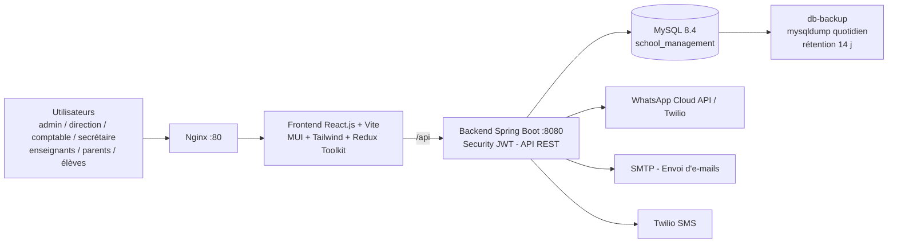
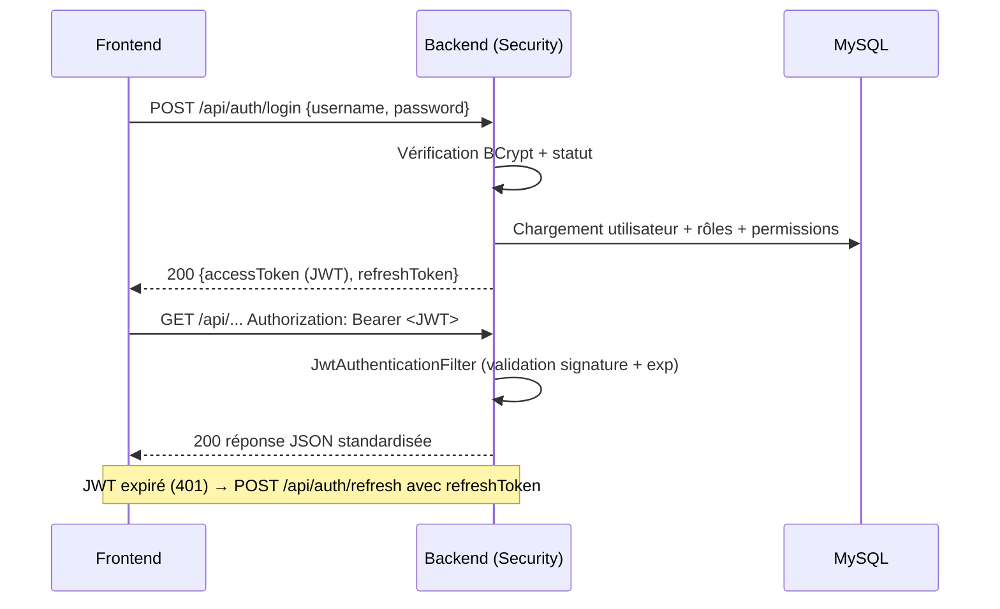
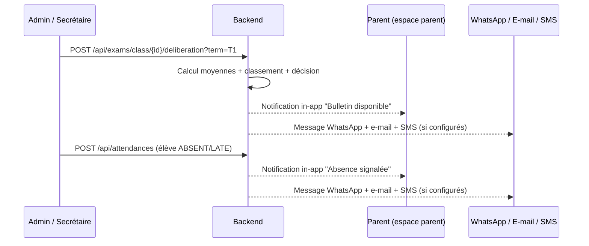
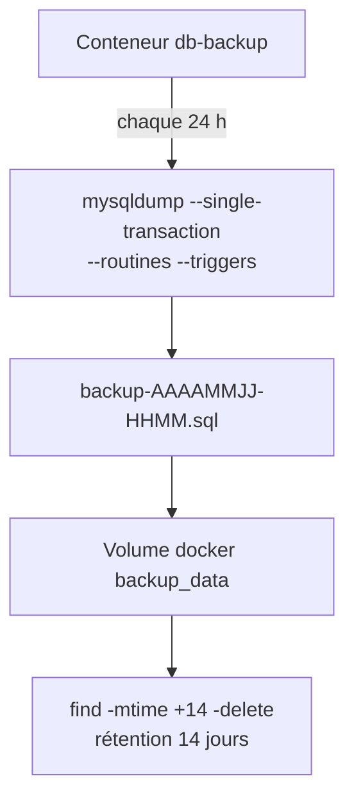

# Diagrammes — School Management System

Diagrammes (format Mermaid) de l'architecture, du modèle de données et des flux clés.
Rendu sur [mermaid.live](https://mermaid.live) ou dans tout éditeur compatible.

---

## 1. Architecture générale (conteneurs)



## 2. Modèle de données (entités principales)

```mermaid
erDiagram
  USERS ||--o{ USER_ROLES : possède
  ROLES ||--o{ USER_ROLES : "assigné à"
  ROLES ||--o{ ROLE_PERMISSIONS : détient
  PERMISSIONS ||--o{ ROLE_PERMISSIONS : "associé à"

  USERS ||--o{ PARENTS : "compte parent"
  USERS ||--o{ STUDENTS : "compte élève"
  USERS ||--o{ REFRESH_TOKENS : ""
  USERS ||--o{ NOTIFICATIONS : reçoit
  USERS ||--o{ MESSAGES : "échange (expéditeur)"
  USERS ||--o{ AUDIT_LOGS : "auteur des actions"

  PARENTS ||--o{ STUDENTS : "parent/tuteur de"

  LEVELS ||--o{ CLASSES : "composée de"
  SECTIONS ||--o{ CLASSES : ""
  ROOMS ||--o{ CLASSES : ""
  CLASSES ||--o{ STUDENTS : inscrit
  CLASSES ||--o{ EXAMS : planifié
  CLASSES ||--o{ SCHEDULES : "emploi du temps"
  CLASSES ||--o{ ATTENDANCES : "pointages"

  SUBJECTS ||--o{ SUBJECT_ASSIGNMENTS : "affecté à"
  TEACHERS ||--o{ SUBJECT_ASSIGNMENTS : enseigne
  TEACHERS ||--o{ CONTRACTS : ""
  TEACHERS ||--o{ PAYROLLS : "paie"
  TEACHERS ||--o{ LEAVES : "congés"
  TEACHERS ||--o{ TEACHER_ATTENDANCES : "présences"

  EXAMS ||--o{ GRADES : "notes"
  STUDENTS ||--o{ GRADES : ""
  EXAMS ||--o{ SCHEDULES : ""
  STUDENTS ||--o{ BULLETINS : ""
  BULLETINS ||--o{ BULLETIN_SUBJECTS : "" : "agrégats par matière"

  FEE_TYPES ||--o{ INVOICES : ""
  STUDENTS ||--o{ INVOICES : ""
  INVOICES ||--o{ PAYMENTS : "encaissé"
  USERS ||--o{ PAYMENTS : "enregistré par"
  EXPENSE_CATEGORIES ||--o{ EXPENSES : ""
  USERS ||--o{ EXPENSES : "validé par"

  BOOKS ||--o{ BORROWINGS : "emprunté"
  STUDENTS ||--o{ BORROWINGS : ""

  ANNOUNCEMENTS }o--o{ ROLES : "ciblée"
```

## 3. Authentification (flux JWT)



## 4. Notification parents (bulletin / absence)



## 5. Sauvegarde automatique

